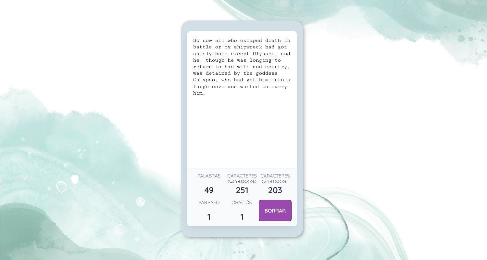
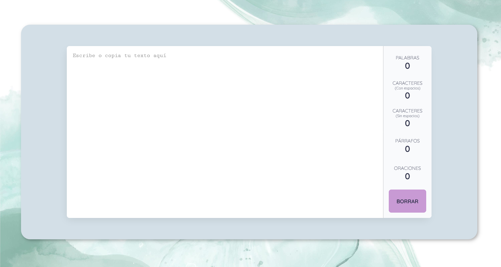
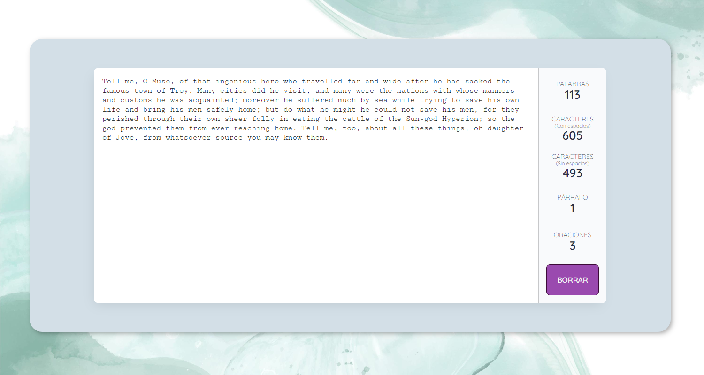

# Contador de palabras *online*

Sencilla y útil herramienta *online* para contar caracteres (con y sin espacios), palabras, oraciones y párrafos.

Permite tanto insertar como pegar texto.

Para borrar todo el texto y la información de los contadores, contiene un útil botón para resetear todo el contenido.

## Capturas de pantalla - *Screenshots*

### Diseño para móvil 

### Diseño para escritorio

## Construido con
- Lenguaje semáNtico HTML5
- Propiedades CSS3
- Flexbox
- Mobile-first*
- Metodología BEM
- JavaScript

## Autora - *Author*
Vanesa Rodríguez

## Licencia - *License*

--------------------------------------------------

# *Online Words Count*

*Simple and useful online tool to count words, characters (with and without white spaces), sentences and paragraphs.*

*You can insert or copy & paste your text.*

*To clean all the text and the information of the counters, the tool it contains a useful button to reset all the content.*

## *Built with*
- *Semantic HTML5 markup*
- *CSS custom properties*
- *Flexbox*
- *Mobile-first workflow*
- *BEM*
- *JavaScript*

**_Wanna look how it works? Check it out!_** 👈